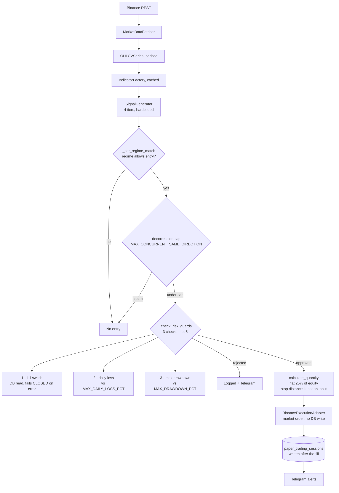
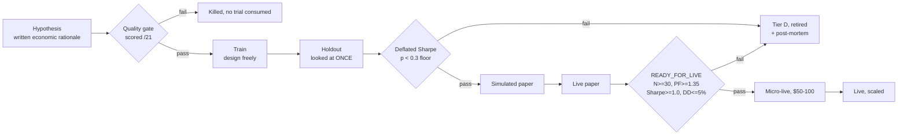

# PARAVANT

[](https://github.com/EvaMndima/Paravant_System/actions/workflows/ci.yml)
[](pyproject.toml)
[](LICENSE)

> ## Do not run the live trading script against real capital
>
> `scripts/run_live_trading.py` enforces three of the eight pre-trade checks
> this repository documents — it reaches no circuit breaker, no dead man's
> switch, no position sizer and no time, event or volatility filter, sizes every
> position at a flat 25% of equity without reference to stop distance, and is
> 22% covered by tests.
>
> The risk package those controls live in is real and well tested. It is not
> connected to the loop that places orders. See
> [What actually runs, and what does not](#what-actually-runs-and-what-does-not).

**An autonomous crypto trading system, built around a validation layer that
decides whether a strategy has a real edge — and is built to return `no` when
the evidence is not there.**

Twenty-nine signal generators have been through it over four months. **None has
a validated edge.**

That is the finding, not a malfunction. The validation layer is the artifact:
gates pre-registered before results are seen, Deflated Sharpe correction for the
number of trials actually run, a deliberately pessimistic cost model, and a map
of where edge has been shown to be absent. Point it at a strategy and it tells
you whether the result survives multiple-comparisons correction and realistic
costs — or whether you were reading noise. It happens that everything pointed at
it so far has been noise.

The most instructive thing it did was catch an error in its own reporting. Eight
subjects were rejected outright at a sample size where the verdict carries
information. Ten more were initially reported as rejected — until the system's
own minimum-evidence guard established that they had never had enough data to
reject at all, and reclassified them as *unmeasurable*.

The difference between "proven worthless" and "never actually measured" is the
whole discipline. A validation layer that catches its own over-claim — in the
direction that makes its own headline weaker — is the strongest evidence
available that it is measuring something rather than confirming something.

---

## Why this might be interesting

Most trading repositories show you a backtest that made money. This one shows
you the machinery that determines whether a backtest that made money *means*
anything, applied adversarially to its author's own work until it returned `no`.

The core question the research layer answers is:

> Did this result come from signal, or from running enough experiments that
> something had to look good?

That is the multiple-comparisons problem. It is why a strategy with a Sharpe of
2.0 discovered on the 200th configuration is worth less than one discovered on
the 2nd — and it is structurally the same problem that makes benchmark numbers
hard to trust anywhere results are searched for rather than predicted: model
evaluation, A/B testing, hyperparameter search, LLM benchmarks.

The defenses implemented here are the standard ones for that class of problem:

| Failure mode | Defense implemented |
|---|---|
| Many experiments, best one reported | Deflated Sharpe Ratio + effective-trial counting |
| Gates moved to fit the result | Thresholds pre-registered before results are seen |
| Test set used for selection | Strict train/holdout separation, holdout looked at once |
| Small-sample illusion | Minimum-evidence gate, `INSUFFICIENT_DATA` distinct from `REJECT` |
| Confounding | Regime-conditional attribution across 8 market states |
| Optimistic cost assumptions | Versioned cost model, deliberately pessimistic |
| Negative results discarded | Negative-space map treats "no edge here" as a finding |

A written protocol (`docs/research/RESEARCH_PROTOCOL.md`) forbids moving a gate
to make a strategy pass, and a pre-registered date — 2026-12-01 — fixes when the
project evaluates whether to stop, against criteria written in advance.

---

## The result

Eight subjects were rejected at a sample size where a Deflated Sharpe verdict
carries information — one strategy from recorded trades, and seven forward
hypotheses screened against backtest:

| Subject | Mechanism | Regime | N | PF | DSR p |
|---|---|---|---|---|---|
| BTF | Multi-timeframe bear trend | — | 25 | 0.54 | 1.000 |
| H-2026-06-002 | Price breakout continuation | TRENDING_BULL | 341 | 0.59 | 1.000 |
| H-2026-06-011 | BTC lead-lag diffusion into alts | TRENDING_BULL | 255 | 0.44 | 1.000 |
| H-2026-06-003 | Perp funding confirmation | TRENDING_BULL | 132 | 0.53 | 1.000 |
| H-2026-06-008 | Cross-sectional relative strength | TRENDING_BULL | 121 | 0.88 | 1.000 |
| H-2026-06-007 | Spot-ETF net-flow demand | TRENDING_BULL | 87 | 0.44 | 1.000 |
| H-2026-06-010 | Coinbase premium | TRENDING_BULL | 75 | 0.35 | 1.000 |
| H-2026-06-006 | Funding-extreme contrarian | HIGH_VOL | 28 | 0.94 | 0.960 |

N is the count in the regime the hypothesis made a claim about; pooled samples
across all regimes run to 974. **Every profit factor is below 1.0** — these are
not marginal edges lost to multiple-comparisons correction, they lose money
before the correction is applied. The `FUNDAMENTAL` tag means the mechanism
failed, not the implementation.

One hypothesis returned `INSUFFICIENT_DATA` at N=4 rather than a rejection —
the guard in the next section working as intended. One was killed at the quality
gate as a structural duplicate before it consumed a trial. Two more are blocked
not on budget but on **causality**: no free historical liquidation series exists
that respects point-in-time correctness, so rather than backfill from a source
that would leak information unavailable at decision time, a forward collector
was built and those hypotheses wait months for N to accrue.

### The part worth reading

The 2026-06-05 retrospective originally reported **all eleven** strategies as
`TIER_D_REJECT`. That report was wrong, and the project's own tooling is what
established it.

Ten of the eleven had between **0 and 4 recorded trades**. The paper-trading
process had been down behind a regional exchange block, so the trade records the
analysis read were nearly empty. A Deflated Sharpe p-value of 1.000 computed on
zero trades is not a finding — it is a null input producing a degenerate output,
and it was being printed next to the word "reject".

The fix was a floor (`MIN_N_FOR_CLASSIFICATION = 10`) checked *before* any
threshold, returning a distinct `INSUFFICIENT_DATA` verdict. From
[`research/promotion/classifier.py`](research/promotion/classifier.py):

> A genuinely edge-less strategy with enough trades still earns `TIER_D`; only
> data *scarcity* yields `INSUFFICIENT_DATA`. The 2026-06-05 run's N=0..4
> strategies were wrongly shown as `TIER_D_REJECT`; this guard prevents that
> "no data" -> "proven noise" misread.

Re-running the stored 2026-06-05 results through the corrected classifier:

```
                        as published    corrected
TIER_D_REJECT                    11            1
INSUFFICIENT_DATA                 0           10
```

This is the oldest error in applied statistics — treating absence of evidence as
evidence of absence — and it is the exact failure the whole research layer was
built to prevent, committed by that research layer, caught by it, and left in
the repository with the superseded report still in place and marked.

**None of this changes the bottom line: zero validated strategies.** It changes
how much of that is *demonstrated* versus merely *unmeasured*, which is a
distinction worth being precise about.

### What was concluded

**TRENDING_BULL is a hard gap, probed from six independent directions.** The six
hypotheses targeting it are not variants of one idea — they are price momentum,
derivatives positioning, ETF flows, cross-sectional ranking, cross-venue premium,
and inter-asset lead-lag. Four of the six use data other than price. All six were
rejected, every one tagged `FUNDAMENTAL` (the mechanism failed, not the code).
The recorded consequence: the next hypothesis for that regime must come from
outside those six classes.

**Funding-based mechanisms are 0-for-3.** All three scored 18/21 at the quality
gate. All three failed.

**The quality scorecard does not predict outcome.** Across the seven screened
hypotheses its score correlates with realised profit factor at Pearson
**r = +0.146**, and the lower-scoring half performed *better* (mean PF 0.73 vs
0.54). Recorded rather than explained away — with the caveat it deserves: n=7
and every outcome is a failure, so this is evidence that it does not predict
*degree of failure*, not proof that it is useless.

Full write-up: **[docs/RESEARCH_FINDINGS.md](docs/RESEARCH_FINDINGS.md)**

---

## Point-in-time correctness

`research/features/` is a feature store that resolves named features *as of* an
instant and returns a value only if it was knowable then. It is the piece of
this repository closest to conventional ML infrastructure, and it exists because
the property it enforces had already been violated.

Six data channels — funding rates, ETF flows, Coinbase prices, BTC thrust,
cross-sectional rank, liquidations — each documented its accessor as causal.
Read one at a time, each looked right. Asking one uniform question of all six
found two that were not: they stamped values with the **start** of the interval
that produced them while the value came from the interval's **end**, so a query
at 10:30 could receive a price from 11:00.

The store removes the possibility rather than the instance. A feature declares
its kind, its interval, and its publication lag; a resolver reports *when* its
value was observed; the store computes when that became knowable and refuses
anything later than the query instant. Causality stops being a property each
channel asserts and becomes arithmetic that is checked.

```python
store.as_of(ts, symbol="BTCUSDT")          # a feature vector, guaranteed causal
store.build_matrix(timestamps, symbol=...)  # a training set, row-wise as-of
```

Two audits, because there are two ways to leak and neither test finds the
other's failure:

| Audit | Catches |
|---|---|
| `audit_knowability` | A record whose timestamp is genuinely past while its **content** is future — the defect above |
| `audit_future_invariance` | A resolver that scans **beyond** the query instant |

Truncating the dataset at 10:30 does not remove the 10:00 bar, so the intuitive
invariance check passes on data leaking 59 minutes. `TestWhyTwoAudits` asserts
exactly that. A suite with only the obvious check would have shipped it.

Both affected hypotheses had already been rejected, and lookahead biases results
optimistically, so correcting it makes those rejections more conservative. No
published conclusion changes. Recorded as `DEC-2026-08-13-001`.

---

## Architecture

Three processes from one image: a read/query API, a paper-trading loop, and a
live loop behind a default-off kill switch.

The diagram below is what `scripts/run_live_trading.py` does, traced from the
source rather than from the design. Until 2026-08-21 this section carried a
different diagram — one that routed every order through `RiskController`, five
circuit breakers and `PositionSizer`. None of those appears anywhere in the
deployed loop. The next section is the accounting.



Three details in that diagram are worth reading twice.

**The kill switch blocks exits, not only entries.** `_check_risk_guards` is
consulted before every order including the one that closes a losing position,
and the exit paths at lines 1325 and 1399 branch on `"kill_switch" in
block_reason` and skip the close. Activating it with a position open disables
the stop-loss and leaves the position running. It is a trading halt, not a flat
button.

**Position size does not consider the stop.** `calculate_quantity(current_equity,
price)` takes no stop-loss argument, so risk per trade is unbounded by stop
width. The `PositionSizer` that computes size from stop distance is at 100%
coverage and is not called.

**The order is placed before anything is persisted.** `submit_market_order`
writes no database row; the record appears later, in `save_state`. A crash or an
HTTP timeout between those two points leaves a position on the exchange with no
record of it, and no reconciliation code exists.

### What actually runs, and what does not

The risk package in `src/core/risk/` is the best-tested subsystem in the
repository. The live loop reaches three of its twelve controls, and reaches
those three by reimplementing them inline rather than by importing them — so
even the three that run are not the tested code.

| Control | Built | Coverage | Reached by the live loop |
|---|---|---|---|
| Kill switch | yes | 96% | **yes** — via an inline DB read, not via `RiskController` |
| Daily loss limit | yes | 99% | **yes** — reimplemented inline against `MAX_DAILY_LOSS_PCT` |
| Max drawdown | yes | 99% | **yes** — reimplemented inline against `MAX_DRAWDOWN_PCT` |
| 5 circuit breakers | yes | 95% | no |
| Dead man's switch | yes | 100% | no |
| Time filter | yes | 100% | no |
| Event filter | yes | 100% | no |
| Volatility filter | yes | 97% | no |
| `PositionSizer` | yes | 100% | no — flat 25% fraction instead |
| Weekly loss limit | yes | 99% | no |
| Concentration check | yes | 99% | no |
| `RiskController` (the pipeline) | yes | 74% | no |

Verify it in one command:

```bash
grep -cE "RiskController|circuit_breaker|dead_man|time_filter|event_filter|VolatilityAnalyzer|PositionSizer|concentration|weekly" scripts/run_live_trading.py
# 0
```

`src/core/orchestrator.py` is the loop that *was* meant to wire these together.
Nothing calls it, and it never wired the circuit breakers, the filters or the
sizer either — so "the deployed path reimplements the orchestrator" understates
it in both directions.

**Paper and live are separate implementations, and the promotion gate depends on
their not being.** This section previously claimed they "share the entire code
path and diverge only at the execution interface". They are two scripts of 2,110
and 946 lines sharing exactly one module-level function name, `main`. Paper
delegates execution to `PaperTradingEngine`; live reimplements stop and
take-profit inline, its correctness asserted only by a docstring claiming
consistency with the paper implementation. `run_paper_trading.py` contains zero
`kill_switch` references. They share the signal path — fetcher, indicators,
generators, regime detection — and diverge across the whole of execution and
risk, which is exactly where paper results are being used to predict live
behaviour.

None of this is repaired here. It is described so that the diagram stops
describing a system that does not exist. Whether the risk layer is wired, or the
live loop deleted, is a decision that comes after the running deployment is
stopped and reconciled — not one to make while it is still up. The findings are
tracked in
[docs/PRODUCTION_READINESS_ASSESSMENT.md](docs/PRODUCTION_READINESS_ASSESSMENT.md).

The research layer sits alongside and may import from `src/`, but `src/` may
never import from `research/`. That one-way boundary means research experiments
cannot change live behaviour, and the research tree could be deleted without
breaking the trading system.



Every strategy that reaches `Tier D` gets a generated post-mortem with a tagged
failure pattern, and every strategy carries an append-only biography. Retirement
is a completed process, not a deletion.

Deeper detail: **[docs/ARCHITECTURE.md](docs/ARCHITECTURE.md)** ·
**[docs/PROJECT_CONTEXT.md](docs/PROJECT_CONTEXT.md)**

---

## What is in here

| Layer | Files | Lines | Notes |
|---|---|---|---|
| `src/` application | 169 `.py` | 49,701 | API, risk, execution, indicators, strategies |
| `tests/` | 142 `.py` | 39,676 | 2,150 tests: 2,113 pass, 37 skip, 0 fail |
| `frontend/src/` | 101 `.ts`/`.tsx` | 18,503 | React 19 dashboard — see caveat below |
| `scripts/` | 25 | 12,064 | Live loop, paper loop, sweeps, reporting |
| `research/` | 32 `.py` | 6,493 | DSR, effective-K, cost model, feature store |

*Figures as of 2026-08-21. Regenerate with `python scripts/doc_stats.py`.*

Highlights:

- **Risk layer** — 8 pre-trade checks, 5 circuit breakers with state that
  survives restart, kill switch, dead man's switch, time/event/volatility
  filters. Position sizing at 100% coverage, checks at 99%. **Three of these
  are reached by the deployed live loop**; the rest are built, tested and not
  called. This bullet listed them without that qualifier until 2026-08-21,
  which read as a description of what protects a live order. See
  [What actually runs, and what does not](#what-actually-runs-and-what-does-not).
- **Live capital model** — per-strategy capital slicing, a concurrency cap, an
  85% capital reserve, and a minimum-notional guard that calls `sys.exit(1)`
  rather than rounding an order up to the exchange minimum.
- **Promotion gate** — a strategy cannot go live until its pooled paper record
  is classified `READY_FOR_LIVE`. Fails *open* on a database error so a restart
  is not blocked; fails *closed* on a clear non-ready verdict.
- **14 indicators**, independently tested at 33-100% coverage, 87% in aggregate.
  Keltner at 33% and Ichimoku at 69% are the two that are not carrying their
  weight. This bullet claimed nineteen indicators at 88-100% until 2026-08-21;
  that count included `base`, `factory`, `cached`, `utils` and `resample`, which
  are scaffolding rather than indicators, and the range was wrong at both ends.
  The miscount is spelled as a word deliberately — `test_doc_consistency.py`
  asserts every digit-form mention of this figure, and cannot tell a live claim
  from a quotation of a retired one.
- **29 signal generators**, of which 0 are validated. That ratio is the point —
  with the caveat that the generators themselves sit at 13-21% line coverage, so
  the suite does not independently establish that a null result came from the
  mechanism rather than the implementation.
- **139 dated architectural decisions** with rationale and rejected
  alternatives, referenced by 78 distinct IDs from source comments.

---

## Quickstart

```bash
git clone <this repo> && cd Paravant_System

python -m venv .venv
.venv\Scripts\activate          # Windows
# source .venv/bin/activate     # Linux / macOS

pip install -r requirements.txt
cp .env.example .env            # placeholders are fine for a read-only run

python scripts/init_db.py
uvicorn src.api.main:app --reload
```

Then open <http://localhost:8000/docs> for the interactive API.

Live trading additionally requires `LIVE_TRADING_ENABLED` to be set explicitly.
It ships commented out in `.env.example`, so a fresh clone cannot place an order
by accident (DEC-2026-05-27-001).

Frontend:

```bash
cd frontend && npm install && npm run dev
```

Research tooling:

```bash
python scripts/retrospective_dsr.py --help    # the DSR analysis
python scripts/validation_report.py --help    # daily operator report
```

---

## What this is not

Stated plainly, because a reviewer will find all of it anyway.

- **Not a profitable trading system.** No strategy here passes its own
  validation gates. If it had an edge, this README would be a different
  document and probably would not exist.
- **Barely authenticated.** The 19 state-mutating endpoints sit behind one
  shared `X-API-Key` and a burst rate cap; the 42 read endpoints are open, there
  are no user identities and no key rotation. Do not expose it to a network you
  do not control. See [SECURITY.md](SECURITY.md).
- **The dashboard is a prototype, and now says so on screen.** 18,000 lines of
  React that make three real network calls. Twelve files call `Math.random()`;
  seven of them are components that fabricate profit and loss, equity curves,
  drawdown series and win/loss outcomes. Until 2026-08-21 that was honest in
  the source and invisible in the browser, which is the wrong way round — a
  plausible equity curve with no label is a claim about a real account. Every
  such component now renders a "Sample data" badge, and the rule is
  **fail-closed**: a chart renders unlabelled only when told explicitly that
  its data is `live`, so untagged data is labelled too. A test enumerates the
  dashboard components, finds the ones calling `Math.random()`, and fails if
  any of them is not provenance-aware — an eighth component gets the badge by
  default rather than by someone remembering (DEC-2026-08-21-003).
- **No trained model.** There is no estimator here. The work adjacent to machine
  learning is the infrastructure and the evaluation discipline: point-in-time
  feature resolution, leakage audits, multiple-comparisons correction, holdout
  hygiene, negative results published rather than filed away.
- **The frontend is not mine from scratch.** It began as a visual prototype
  built in Google AI Studio and was ported here and rebuilt on Tailwind v3.
  Productionising it was real work; designing it was not. Six pages still need
  wiring to the API. It has 62 tests across five files — the shared formatters,
  the regime hook, the positions table, the emergency-panel confirmation gate,
  and routing — against 74 components, with no coverage floor. Most of the
  dashboard is unverified. This line read "the dashboard has no tests" until
  2026-08-21; that was true when written and was left standing after the Vitest
  job landed on 2026-08-16, contradicting the CI table further down this file.
- **`src/core/orchestrator.py` is 1,850 lines that nothing calls, deliberately
  kept.** It is a fully built, tested main loop with 68% coverage, and no
  application code references it — the last two callers, `/system/start` and
  `/system/stop`, were removed on 2026-08-21 because they needed an orchestrator
  instance nothing ever supplied and returned 503 in every environment for their
  entire existence. Wiring it was considered and rejected: it would promote a
  loop that has never executed once over one that has, on no evidence, and it
  would not deliver the risk layer either, because `orchestrator.py` has no
  circuit-breaker, filter or `PositionSizer` references of its own. That moves
  which loop is unwired rather than fixing it. Four of its five classes are
  components the deployed loop genuinely lacks, which is why the file stays.
  Written up as a case study in
  [docs/AI_ASSISTED_DEVELOPMENT.md](docs/AI_ASSISTED_DEVELOPMENT.md) §4.2 —
  local coherence is not integration.
- **Six methodology defects in the research layer remain open** and
  severity-ranked in
  [docs/research/RESEARCH_FIXLIST.md](docs/research/RESEARCH_FIXLIST.md); the
  engineering findings are in
  [docs/PRODUCTION_READINESS_ASSESSMENT.md](docs/PRODUCTION_READINESS_ASSESSMENT.md).
- **The engine ran without connection liveness checking for six months, and it
  cost an outage.** `create_engine` was called with no pool configuration from
  the first commit. That is invisible against local SQLite and wrong against
  the managed Postgres production actually runs on: the provider closes idle
  connections, SQLAlchemy hands out one that is already dead, and the query
  fails with `psycopg2.OperationalError: SSL connection has been closed
  unexpectedly`. On 2026-08-15 that took down regime persistence. Fixed
  2026-08-21 with `pool_pre_ping` and a 300-second `pool_recycle`
  (DEC-2026-08-21-002). It is recorded here rather than quietly repaired
  because the sequence is the useful part: an audit predicted the failure from
  the absence of two keyword arguments, and the failure had already happened.
  A prediction that is later confirmed is better evidence than either the
  prediction or the incident alone, and the reason it went unnoticed for six
  months — development on one database, production on another — is a more
  general lesson than the fix is.
- **Not built alone in the conventional sense.** One person working with AI
  coding assistants throughout. Where that approach held up, where it broke, and
  what had to be built to catch the breaks is in
  [docs/AI_ASSISTED_DEVELOPMENT.md](docs/AI_ASSISTED_DEVELOPMENT.md).

---

## Documentation

**Start here**

- [docs/README.md](docs/README.md) — documentation index and reading order
- [docs/PROJECT_CONTEXT.md](docs/PROJECT_CONTEXT.md) — complete briefing; readable without opening a source file
- [docs/research/RESEARCH_PROTOCOL.md](docs/research/RESEARCH_PROTOCOL.md) — the method, and what it forbids
- [docs/AI_ASSISTED_DEVELOPMENT.md](docs/AI_ASSISTED_DEVELOPMENT.md) — what AI-assisted development actually broke

**The result**

- [docs/research/retrospective/](docs/research/retrospective/) — per-strategy DSR post-mortems
- [docs/research/NEGATIVE_SPACE_MAP.md](docs/research/NEGATIVE_SPACE_MAP.md) — where edge is proven absent
- [docs/research/RESEARCH_FIXLIST.md](docs/research/RESEARCH_FIXLIST.md) — the research layer's own known defects, six still open

**Engineering**

- [docs/ARCHITECTURE.md](docs/ARCHITECTURE.md) · [docs/API_CONTRACT.md](docs/API_CONTRACT.md) · [docs/INDICATOR_SPECIFICATION.md](docs/INDICATOR_SPECIFICATION.md)
- [.claude/DECISIONS.md](.claude/DECISIONS.md) — 139 decisions with rationale and rejected alternatives
- [docs/operations/](docs/operations/) — kill-switch runbook, scheduled jobs
- [docs/PRODUCTION_READINESS_ASSESSMENT.md](docs/PRODUCTION_READINESS_ASSESSMENT.md) — measured gaps and the plan

---

## Development

```bash
pytest                                        # full suite
pytest -m unit                                # fast path
pytest --cov=src --cov=research --cov-report=term

ruff check src/ research/ scripts/ tests/
mypy src/ research/features/
python scripts/doc_stats.py                   # regenerate the figures above
```

Network-dependent tests skip by default. Set `PARAVANT_RUN_NETWORK_TESTS=1` to
run them against Binance testnet.

### Continuous integration

`.github/workflows/ci.yml` gates every push and pull request:

Eleven jobs. Every one of them blocks — none is advisory.

| Job | Enforces |
|---|---|
| Lint | `ruff` over `src`, `research`, `scripts`, `tests` **and** `alembic` |
| Type check | `mypy` over `src/` and `research/features/` |
| Dependency audit | `pip-audit` against the pinned production set |
| **Secret scan** | `gitleaks` over the **whole history**, pinned to 8.30.1 |
| Tests | Python 3.11, 3.12, 3.13 |
| Coverage | Floor at 72% (measured 74%), over the **whole** suite |
| **Migrations** | Apply the whole Alembic chain to an empty database, downgrade to base and back, then assert the resulting schema equals the ORM models |
| **Quickstart** | Fresh install, `init_db`, `verify_db`, boot the API, assert `/health` — on **Linux and Windows** |
| Frontend | `tsc -b` and production build |
| Frontend tests | Vitest — formatters, data hook, positions table, confirmation gate, synthetic-data provenance |
| Frontend lint | `eslint`, 0 errors |

The quickstart job exists because the documented first command of this README
once exited 1 with a traceback on Windows, and 1,900 passing tests said nothing
about it: tests import modules and call functions, and nobody had run the
entrypoint.

Frontend lint became a real gate on 2026-08-13 once eslint reported 0 errors.
80 warnings remain and are expected to; `--max-warnings` is deliberately not set
to 0, so the count stays visible while it is driven down rather than hidden by a
blanket disable.

---

## License

MIT, with a financial-software risk notice. See [LICENSE](LICENSE).

This software can place real orders and lose real money. It is published as an
engineering artifact, not as investment advice, and it comes with no warranty.
