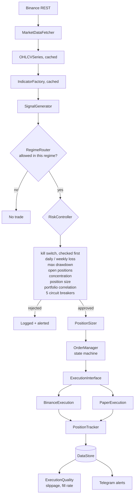
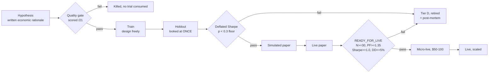

# PARAVANT

**An autonomous crypto trading system, and a validation layer built to prove
its own strategies don't work.**

It succeeded. Of eleven strategies developed over four months, **zero** survived
statistical correction for the number of experiments run. Two further
hypotheses, tested afterwards under a pre-registered protocol, were also
rejected — at sample sizes of 341 and 132 trades, with no capital at risk.

That is the result this repository exists to report. The trading engine is the
supporting cast.

---

## Why this might be interesting

Most trading repositories show you a backtest that made money. This one shows
you the machinery that determines whether a backtest that made money *means*
anything, applied adversarially to its author's own six months of work until it
returned `no`.

The core question the research layer answers is:

> Did this result come from signal, or from running enough experiments that
> something had to look good?

That is the multiple-comparisons problem. It is why a strategy with a Sharpe of
2.0 discovered on the 200th configuration is worth less than one discovered on
the 2nd — and it is structurally the same problem that makes benchmark numbers
hard to trust anywhere results are searched for rather than predicted: model
evaluation, A/B testing, hyperparameter search, LLM benchmarks.

The defenses implemented here are the standard ones for that class of problem:

| Failure mode | Defense implemented |
|---|---|
| Many experiments, best one reported | Deflated Sharpe Ratio + effective-trial counting |
| Gates moved to fit the result | Thresholds pre-registered before results are seen |
| Test set used for selection | Strict train/holdout separation, holdout looked at once |
| Small-sample illusion | Minimum-evidence gate, `INSUFFICIENT_DATA` distinct from `REJECT` |
| Confounding | Regime-conditional attribution across 8 market states |
| Optimistic cost assumptions | Versioned cost model, deliberately pessimistic |
| Negative results discarded | Negative-space map treats "no edge here" as a finding |

A written protocol (`docs/research/RESEARCH_PROTOCOL.md`) forbids moving a gate
to make a strategy pass, and a pre-registered date — 2026-12-01 — fixes when the
project evaluates whether to stop, against criteria written in advance.

---

## The result

From `docs/research/retrospective/PORTFOLIO_SUMMARY_2026-06-05.md`:

```
Strategies analysed under Deflated Sharpe:            11
Surviving the DSR floor (p < 0.3):                     0
  Tier A (deploy)                                      0
  Tier B (half size)                                   0
  Tier C (observe)                                     0
  Tier D (reject)                                      5
Previously-retired strategies, confirmed correct:    6/6
False negatives found:                                 0
```

All five strategies previously classified `KEEP` — including the portfolio's
most-trusted multi-regime performer — failed once corrected for the number of
trials run. The method also *confirmed* every prior retirement, so it was not
simply rejecting everything.

Two forward hypotheses followed, under the full pre-registered protocol:

| Hypothesis | Mechanism | N | Profit factor | DSR p | Verdict |
|---|---|---|---|---|---|
| H-2026-06-002 | Price breakout continuation | 341 | 0.59 | 1.0 | Rejected |
| H-2026-06-003 | Perp-funding-confirmed trend | 132 | 0.53 | 1.0 | Rejected |

A third was killed at the hypothesis-quality gate as a structural duplicate,
before consuming a trial.

**Conclusion recorded:** trending-bull continuation is a hard gap across two
distinct mechanism classes. A calibration lesson was recorded alongside it — the
hypothesis that scored *higher* at the quality gate performed *worse*, meaning
the scorecard measures mechanism plausibility and not expected profitability.
That was written down rather than explained away.

Full write-up: **[docs/research/](docs/research/)**

---

## Architecture

Three processes from one image: a read/query API, a paper-trading loop, and a
live loop behind a default-off kill switch. Paper and live share the entire code
path and diverge only at the execution interface, which is what makes paper
results usable as a promotion gate.



The research layer sits alongside and may import from `src/`, but `src/` may
never import from `research/`. That one-way boundary means research experiments
cannot change live behaviour, and the research tree could be deleted without
breaking the trading system.



Every strategy that reaches `Tier D` gets a generated post-mortem with a tagged
failure pattern, and every strategy carries an append-only biography. Retirement
is a completed process, not a deletion.

Deeper detail: **[docs/ARCHITECTURE.md](docs/ARCHITECTURE.md)** ·
**[docs/PROJECT_CONTEXT.md](docs/PROJECT_CONTEXT.md)**

---

## What is in here

| Layer | Files | Lines | Notes |
|---|---|---|---|
| `src/` application | 167 `.py` | 49,144 | API, risk, execution, indicators, strategies |
| `tests/` | 133 `.py` | 36,363 | 1,905 tests, 63% coverage |
| `frontend/src/` | 89 `.ts`/`.tsx` | 17,128 | React 19 dashboard — see caveat below |
| `scripts/` | 24 | 11,865 | Live loop, paper loop, sweeps, reporting |
| `research/` | 27 `.py` | 5,411 | DSR, effective-K, cost model, biographies |

Highlights:

- **Risk layer** — 8 pre-trade checks, 5 circuit breakers with state that
  survives restart, kill switch, dead man's switch, time/event/volatility
  filters. Position sizing at 100% coverage, checks at 99%.
- **Live capital model** — per-strategy capital slicing, a concurrency cap, an
  85% capital reserve, and a minimum-notional guard that calls `sys.exit(1)`
  rather than rounding an order up to the exchange minimum.
- **Promotion gate** — a strategy cannot go live until its pooled paper record
  is classified `READY_FOR_LIVE`. Fails *open* on a database error so a restart
  is not blocked; fails *closed* on a clear non-ready verdict.
- **19 indicators**, each independently tested at 88-100% coverage.
- **29 signal generators**, of which 0 are validated. That ratio is the point.
- **116 dated architectural decisions** with rationale and rejected
  alternatives, referenced by 69 distinct IDs from source comments.

---

## Quickstart

```bash
git clone <this repo> && cd Paravant_System

python -m venv .venv
.venv\Scripts\activate          # Windows
# source .venv/bin/activate     # Linux / macOS

pip install -r requirements.txt
cp .env.example .env            # placeholders are fine for a read-only run

python scripts/init_db.py
uvicorn src.api.main:app --reload
```

Then open <http://localhost:8000/docs> for the interactive API.

Live trading additionally requires `LIVE_TRADING_ENABLED` to be set explicitly.
It is deliberately absent from `.env.example`, so a fresh clone cannot trade by
accident.

Frontend:

```bash
cd frontend && npm install && npm run dev
```

Research tooling:

```bash
python scripts/retrospective_dsr.py --help    # the DSR analysis
python scripts/validation_report.py --help    # daily operator report
```

---

## What this is not

Stated plainly, because a reviewer will find all of it anyway.

- **Not a profitable trading system.** No strategy here passes its own
  validation gates. If it had an edge, this README would be a different
  document and probably would not exist.
- **Not authenticated.** All 63 API endpoints are open, including 21 that mutate
  state. Do not expose it to a network you do not control. See
  [SECURITY.md](SECURITY.md).
- **The dashboard is a prototype.** 17,000 lines of React that make three real
  network calls. Every other page renders static seed data and the simulated
  ticker is labelled as such in code. It is honest in the source and it is not
  finished.
- **Not machine learning.** There is no model here. This is systems engineering
  and quantitative research methodology. The overlap with AI engineering is the
  evaluation discipline, not the algorithms.
- **Not fully clean.** 9 tests fail on `master`, 32 network-dependent
  integration tests error rather than skip without exchange credentials, and
  static analysis reports outstanding errors against a config that claims strict
  typing. All of it is enumerated in
  [docs/PRODUCTION_READINESS_ASSESSMENT.md](docs/PRODUCTION_READINESS_ASSESSMENT.md),
  which was written to be uncomfortable rather than flattering.
- **Not built alone in the conventional sense.** It was built by one person
  working with AI coding assistants throughout. What that was actually like,
  including six specific defects it produced and how long each survived, is in
  [docs/AI_ASSISTED_DEVELOPMENT.md](docs/AI_ASSISTED_DEVELOPMENT.md).

---

## Documentation

**Start here**

- [docs/PROJECT_CONTEXT.md](docs/PROJECT_CONTEXT.md) — complete briefing; readable without opening a source file
- [docs/research/RESEARCH_PROTOCOL.md](docs/research/RESEARCH_PROTOCOL.md) — the method, and what it forbids
- [docs/AI_ASSISTED_DEVELOPMENT.md](docs/AI_ASSISTED_DEVELOPMENT.md) — what AI-assisted development actually broke

**The result**

- [docs/research/retrospective/](docs/research/retrospective/) — per-strategy DSR post-mortems
- [docs/research/NEGATIVE_SPACE_MAP.md](docs/research/NEGATIVE_SPACE_MAP.md) — where edge is proven absent
- [docs/research/RESEARCH_FIXLIST.md](docs/research/RESEARCH_FIXLIST.md) — the research layer's own known defects, six still open

**Engineering**

- [docs/ARCHITECTURE.md](docs/ARCHITECTURE.md) · [docs/API_CONTRACT.md](docs/API_CONTRACT.md) · [docs/INDICATOR_SPECIFICATION.md](docs/INDICATOR_SPECIFICATION.md)
- [.claude/DECISIONS.md](.claude/DECISIONS.md) — 116 decisions with rationale and rejected alternatives
- [docs/operations/](docs/operations/) — kill-switch runbook, scheduled jobs
- [docs/PRODUCTION_READINESS_ASSESSMENT.md](docs/PRODUCTION_READINESS_ASSESSMENT.md) — measured gaps and the plan

---

## Development

```bash
pytest                                        # full suite
pytest -m unit                                # fast path
pytest --cov=src --cov=research --cov-report=term

ruff check src/ research/ scripts/
mypy src/
black src/ tests/
```

---

## License

MIT, with a financial-software risk notice. See [LICENSE](LICENSE).

This software can place real orders and lose real money. It is published as an
engineering artifact, not as investment advice, and it comes with no warranty.
