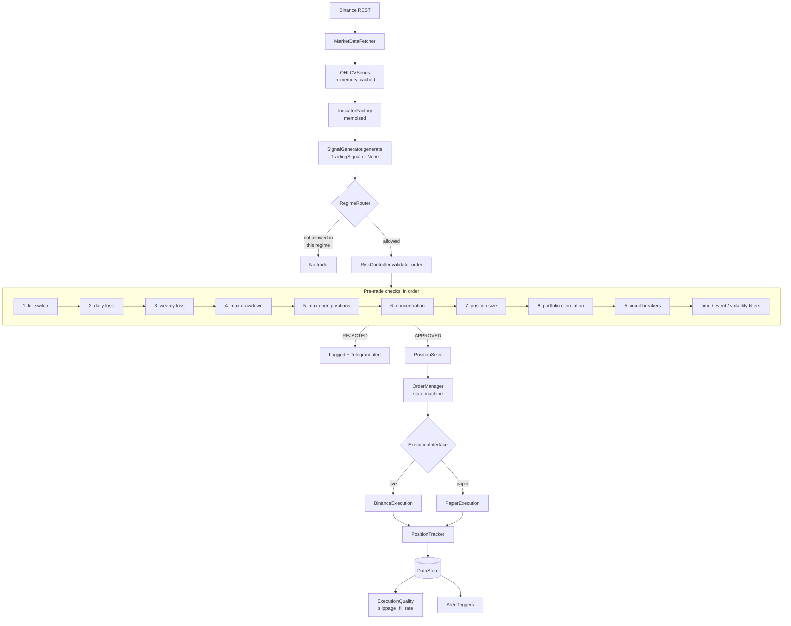
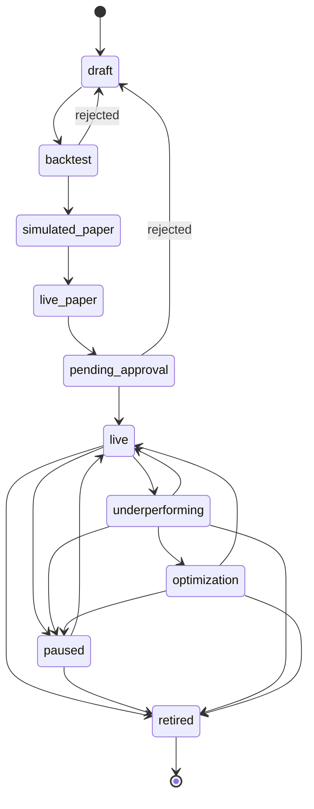

# PARAVANT — Architecture (as built)

**Describes:** the system as it exists on `master`, verified 2026-08-11
**Companion:** [PROJECT_CONTEXT.md](PROJECT_CONTEXT.md) covers *what exists and
why* in narrative form. This document covers *how it is put together*.

The original pre-implementation design document is preserved at
[archive/ARCHITECTURE_2026-02-08_original_design.md](archive/ARCHITECTURE_2026-02-08_original_design.md).
Section 10 below records where it and reality diverged.

---

## 1. Runtime topology

Three processes, all built from one Docker image, plus scheduled jobs.

| Process | Entry point | Role |
|---|---|---|
| `web` | `uvicorn src.api.main:app` | Read/query API and dashboard backend |
| `paper` | `scripts/run_paper_trading.py` | Simulation loop against live market data |
| `live` | `scripts/run_live_trading.py` | Real-capital loop, kill-switch gated |

Scheduled on Railway (see [operations/RAILWAY_CRONS.md](operations/RAILWAY_CRONS.md)):
a daily validation report to Telegram at 09:00 UTC, which is the operational
heartbeat during the paper-trading waiting period.

Persistence is SQLite in development and PostgreSQL (Neon) in production. A
Railway volume must be mounted at `/app/data` or SQLite state resets on deploy.

---

## 2. Layer map

Each module states what it owns and, as importantly, what it does not.

| Layer | Path | Owns | Does not own |
|---|---|---|---|
| API | `src/api/` | HTTP surface, serialisation, request logging, error shaping | Business rules, persistence |
| Brokers | `src/brokers/binance/` | Exchange protocol, rate limiting, retry, geo-block detection | Order lifecycle, risk |
| Execution | `src/core/execution/` | Order state machine, position tracking, P&L accounting, slippage/fill measurement | Whether an order *should* be placed |
| Risk | `src/core/risk/` | Pre-trade checks, circuit breakers, kill switch, sizing, filters | Signal generation, execution |
| Strategy | `src/core/strategy/` | Signal generation, backtest, paper engine, regime routing | Risk decisions, execution |
| Indicators | `src/core/indicators/` | 19 indicator implementations, caching, resampling | Trading decisions |
| Data | `src/data/` | 15 ORM models, `DataStore` facade, market data, validators, cache | Business rules |
| Alerting | `src/core/alerting/` | Telegram channel, 15 trigger types, scheduler, escalation | Deciding what is alarming |
| Config | `src/core/config/` | YAML + env layering, templates, risk profiles, backup | Runtime mutation of config |
| Research | `research/` | DSR, effective-K, cost model, tier classification, biographies | Anything that runs live |
| Features | `research/features/` | Point-in-time resolution, knowability arithmetic, leakage audits | Fetching, caching, feature computation |

`src/core/pnl/` is deliberately empty. Its `__init__.py` documents that P&L
logic lives in `execution/position_tracker.py` to avoid an import cycle, and
warns against moving code into it.

---

## 3. The trading path



Two properties of this path matter more than the rest:

**The kill switch is check 1, not check 8.** It is evaluated before any other
condition, on every cycle, before a strategy is even considered. Ordering here
is a correctness property, not a style choice.

**Paper and live diverge only at `ExecutionInterface`.** Identical signal
generation, identical risk checks, identical position tracking. This is what
makes a paper record admissible as evidence for promotion to live — the two are
not separate implementations that could drift.

---

## 4. State ownership

Each piece of mutable state has exactly one authoritative owner. Everything else
reads.

| State | Owner | Persistence |
|---|---|---|
| Kill switch, degradation mode, regime | `SystemState` (singleton row) | Database |
| Open positions | `PositionTracker` | `positions` table, reconciled on startup |
| Order lifecycle | `OrderManager` state machine | `orders` table |
| Circuit breaker trip state | `CircuitBreakerManager` | Serialised to database; **survives restart** |
| Account equity history | `EquitySnapshot` | Append-only time series |
| Strategy lifecycle status | `StrategyEngine` | `strategies` table, transitions validated |
| Configuration | `config/` YAML + env | Read-only at runtime |

Circuit breaker persistence is deliberate: a tripped breaker is not cleared by
the process dying and restarting. Restart is not a reset.

---

## 5. Async boundaries

The system is async-first (DEC-2026-02-10-004), with three deliberate exceptions:

- **Backtest and simulated paper run synchronously** (DEC-2026-02-15-001).
  Replaying candles is CPU-bound; asyncio buys nothing and costs debuggability.
- **Blocking database calls are wrapped** in `asyncio.to_thread` at the
  boundary rather than scattered through the call graph.
- **Time is injectable** (DEC-2026-02-12-012). Components that depend on the
  clock accept it as a dependency so time-dependent logic is testable without
  sleeping.

---

## 6. The research boundary

```
research/  --may import-->  src/
src/       --MUST NOT-->    research/
```

Enforced by convention and verified by inspection (DEC-2026-06-04-001). Two
consequences:

1. The entire `research/` tree could be deleted without breaking the trading
   system.
2. A research experiment cannot accidentally change live behaviour.

Promotion across the boundary is explicit: a generator proven in
`research/generators/` is *reimplemented* in `src/core/strategy/generators/`
(DEC-2026-06-04-004). Nothing runs live from the research tree. To date nothing
has been promoted, because nothing has passed.

---

## 7. Data model

15 SQLAlchemy 2.0 models, all `Mapped[T]`-typed, all timestamps timezone-aware
UTC, all financial fields guarded by `@validates` rejecting NaN, Infinity and
negatives, all mutable defaults built by lambda factories.

`Account`, `Strategy`, `StrategyAssignment`, `Order`, `Trade`, `Position`,
`PnLRecord`, `EquitySnapshot`, `Signal`, `SymbolInfo`, `SystemState`,
`PaperTradingSession`, `SlippageRecord`, `FillRateRecord`, `AuditLog`.

Strategy lifecycle:

Transcribed from `VALID_TRANSITIONS` in `src/core/strategy/engine.py`:



Two properties worth noting. Promotion is strictly linear — there is no path
from `draft` to `live` that skips backtest, simulated paper, live paper and
explicit approval. And `retired` is genuinely terminal: it has no outgoing
transitions, so a retired strategy cannot be quietly revived. Reviving one means
creating a new strategy, which means it re-enters at `draft` and earns its way
back through every gate.

Transitions are validated by `StrategyEngine`, not assigned freely.

### How the schema is actually created

This section previously read "Schema is managed by Alembic across 6 revisions."
That was not true, and the correction matters more than the sentence did.

Six Alembic revisions exist under `alembic/versions/`, and **no runtime invokes
any of them**. `grep -rn "alembic" --include="*.py" --include="*.yml" scripts/
.github/ Dockerfile Procfile railway.toml` returns nothing. Every path that
creates a schema calls `init_db()` (`src/data/database.py:29`), whose entire body
is `Base.metadata.create_all(bind=engine)` at line 31 — `scripts/init_db.py:17`,
`scripts/run_paper_trading.py:725`, `scripts/run_live_trading.py:1620` and
`scripts/validation_report.py:424`.

The consequence is the part worth knowing. `create_all()` creates tables that do
not exist and **silently skips tables that do**; it never emits `ALTER TABLE`.
Against a database that already has the tables — which on Railway is every
deploy after the first, because the volume persists — a model change reaches
nothing. It surfaces later as `no such column` at query time rather than as a
failure at deploy time.

Two live consequences of this, both recorded rather than fixed in this pass:

- The unique constraint on `strategy_assignments (account_id, strategy_id)`
  exists only in `alembic/versions/20260209_add_unique_constraint_strategy_assignments.py`
  and is not declared on the model, so no running system enforces it.
- Nothing compares the migration chain against the ORM models, so the two are
  free to diverge without any signal.

Both are tracked in
[PRODUCTION_READINESS_ASSESSMENT.md](PRODUCTION_READINESS_ASSESSMENT.md).

---

## 8. API surface

FastAPI. **63 endpoints across 13 route modules, 21 of which mutate state**,
plus 4 root endpoints (`/health`, `/ready`, `/health/detailed`, `/`).

Middleware: `request_logger` (structured logs with request IDs) and
`error_handler` (detail in development, generic message in production). CORS is
an explicit allowlist with no wildcard — fixing what was originally a critical
vulnerability (DEC-2026-02-08-004).

### 8.1 Authentication

The 21 state-mutating endpoints require a shared secret in an `X-API-Key`
header. The 42 read endpoints do not: the dashboard is a read-only browser
client, and gating it would break that client for no safety gain.

The gate is **middleware keyed on HTTP method**, not a `Depends` on each route
(`src/api/auth.py`, DEC-2026-08-14-001). A per-route dependency is the
idiomatic FastAPI approach and it is fail-open — protection would depend on the
author of every future endpoint remembering to add it, and nothing would fail
when they did not. Gating by method is fail-closed: a mutating endpoint added
tomorrow is covered the day it is written.

The cost is that the requirement does not appear in the OpenAPI schema. The
compensating control is `tests/unit/api/test_auth.py::TestMutatingRouteCoverage`,
which enumerates `app.routes` and asserts every mutating route returns 401
without a key, so an unguarded endpoint is a test failure rather than a silent
exposure.

Ordering is load-bearing. Starlette makes the last-added middleware outermost,
so the auth layer is added **before** `CORSMiddleware` in order to sit inside
it. An auth layer outside CORS returns 401s without CORS headers, which a
browser reports as an opaque network error rather than an authentication
failure. `TestMiddlewareOrdering` guards this.

Configuration is `PARAVANT_API_KEY`. Outside `ENVIRONMENT=development` a
missing key aborts startup; a key under 32 characters is rejected in every
environment. In development a missing key disables the gate and logs
`api_auth_disabled`, which keeps the documented quickstart runnable.

**What this is not:** one shared key, no identities, no rotation, no expiry, and
open reads. It authenticates a request, not a person. The limits are enumerated
in [../SECURITY.md](../SECURITY.md).

### 8.2 Rate limiting

Mutating requests are additionally capped (`src/api/rate_limit.py`,
DEC-2026-08-14-003). Two independent token buckets:

| Bucket | Default | Keyed on | Purpose |
|---|---|---|---|
| Per-client | 30/min | leftmost `X-Forwarded-For`, else peer IP | Fairness. Best-effort — that header is client-supplied and spoofable |
| Global | 120/min | nothing | The real cap. Trusts no client value, so it cannot be evaded by rotating a header |

Per-client alone would not work: behind a proxy the real client address arrives
in a header the client sets, so an attacker rotates it and evades the bucket
entirely — while also filling the identity map. Hence the global bucket, and
hence a bounded LRU (1,024 entries) so the map cannot be used to exhaust memory.

**It reuses the `TokenBucket` primitive from
`src/brokers/binance/rate_limiter.py` (DEC-2026-02-10-002) but not the
`RateLimiter` policy.** That class blocks with `asyncio.sleep` until tokens free
up, which is right for outbound calls to Binance where waiting beats a ban. It
is wrong inbound: a held request occupies a connection and a coroutine, so
blocking would turn 10,000 requests into 10,000 sleeping tasks — the limiter
would amplify the flood it exists to absorb. Inbound rejects with `429` and a
`Retry-After` header.

Ordering: this layer sits **inside** the auth layer, so unauthenticated floods
are rejected by auth for a cheap 401 and consume no rate budget. Placed outside,
an anonymous flood could exhaust the global bucket and lock the operator out of
their own kill switch.

**What this is not:** buckets live in process memory, so limits multiply by
uvicorn worker count (deployment runs one) and reset on restart. It bounds the
*rate* of damage from a leaked key, not the *total*.

---

## 9. Failure modes

Honest status. "Covered" means tests specifically exercise the behaviour, not
that the module has coverage.

| Scenario | Behaviour | Covered |
|---|---|---|
| Kill switch active | No order is evaluated; checked first every cycle | Yes — 14 test files |
| Circuit breaker tripped | Trading halts; state persists across restart | Yes — 4 test files |
| Market regime `UNKNOWN` or `TRANSITIONAL` | `regime_tags`-tagged strategies do not activate. Better quiet than wrong-regime | Yes — 19 tests in `test_sub_regime_routing.py` |
| Main loop stops heartbeating | Dead man's switch halts trading | Partial — 1 test file |
| Subsystem failure | Degradation mode; alert on entering and leaving | Partial — 2 test files |
| Binance regional block | Fail fast, stop retrying rather than burning rate limit (DEC-2026-06-01-003) | Partial — 1 test file |
| Per-trade notional below exchange minimum | Startup guard calls `sys.exit(1)` rather than rounding up | **No** — `scripts/` is largely unmeasured |
| Database unavailable during promotion check | Fails **open** so a restart is not blocked | Partial |
| Strategy fails validation at startup | Startup aborts; programming errors now propagate with a traceback (DEC-2026-08-11-002) | Yes — 5 tests against a real engine |
| Exchange outage mid-order | Retry with backoff; order state machine holds pending state | Partial |
| Clock skew | **Not handled explicitly** | No |
| Stop/take-profit gapping through | **Not modelled** — assumes no gap-through (PARA-07, open) | No |

The bottom three rows are the honest edge of the system. `scripts/` — including
the 2,111-line live loop — has almost no direct test coverage, which is the
largest single testing gap.

---

## 10. Where the design and the build diverged

The February design document is archived rather than deleted because this
section is more useful with it than without it.

| Designed | Built | Why |
|---|---|---|
| A multi-broker adapter pattern with pluggable exchange configs | Binance only, no adapter registry | Scope locked (DEC-2026-01-15-002). The abstraction would have been speculative generality with one implementation |
| `src/core/pnl/` as a P&L module | Empty package; logic in `execution/position_tracker.py` | Import cycle risk, and fill processing and P&L accounting are cohesive. Recorded in the package docstring |
| One orchestrated async main loop (`orchestrator.py`) | Built, tested, **never wired**. `scripts/run_live_trading.py` independently reimplements it | Not a decision — a genuine unresolved duplication. `set_orchestrator()` is defined and never called. See [AI_ASSISTED_DEVELOPMENT.md](AI_ASSISTED_DEVELOPMENT.md) section 4.2 |
| A flat `regime.py` module | A `regime/` package; the flat module was shadowed and dead for months before removal | Incremental refactor that correctly migrated contents and left the original in place |
| A read-only monitoring dashboard | 17,000 lines of React making 3 real network calls; the rest renders seed data | Presentation was built ahead of integration. Labelled as such in source |
| Futures long/short evaluation, gated for possible live use | Research-only. Never crossed to live | The research found spot long-only *outperforms* futures for these strategies, so live futures was never needed |

The third row is a real defect, not a trade-off, and it is recorded as open.

---

## 11. Where to look

| Concern | File |
|---|---|
| Live capital model and promotion gates | `scripts/run_live_trading.py` |
| Designed-but-unwired main loop | `src/core/orchestrator.py` |
| Daily operator report | `scripts/validation_report.py` |
| Pre-trade risk checks | `src/core/risk/checks.py` |
| Circuit breakers | `src/core/risk/circuit_breakers.py` |
| Position sizing and exchange constraints | `src/core/risk/sizing.py` |
| Order lifecycle | `src/core/execution/order_manager.py` |
| Data access facade | `src/data/store.py` |
| Backtest | `src/core/strategy/backtest/engine.py` |
| Regime routing | `src/core/strategy/regime/router.py` |
| Deflated Sharpe Ratio | `research/validation/deflated_sharpe.py` |
| Tier classification | `research/promotion/classifier.py` |
| Architectural decisions | `.claude/DECISIONS.md` |
